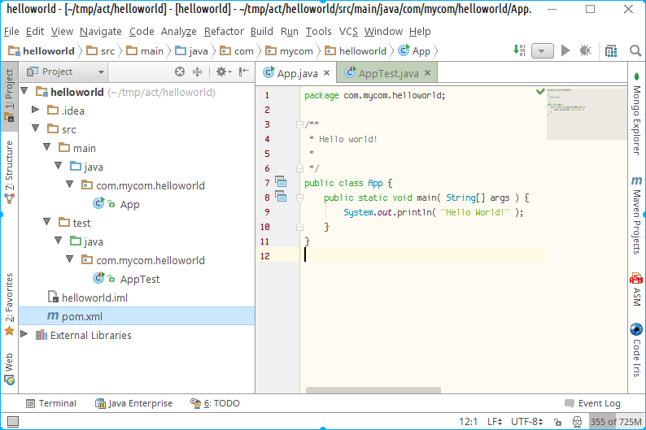
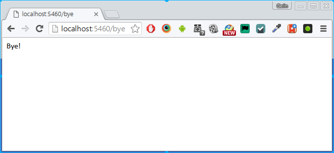
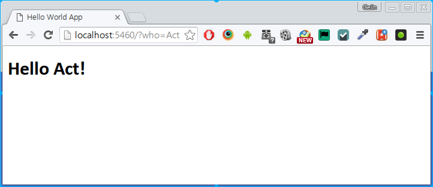
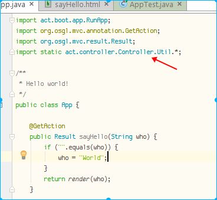

# Getting start with ActFramework

## <a name="prerequisites"></a>Prerequisites

You need JDK and Maven to create Act application. An internet connection should be ready for downloading libraries from maven central repository

1. JDK (Java Development Kit), version 1.6 and above
1. Maven (Project Management Tool), version 3.3 and above

If you already have the JDK and Maven installed you can safely skip the following sections.

### Install JDK

You can download JDK from [Java official web site](http://www.oracle.com/technetwork/java/javase/downloads/index.html)

### Install Maven

You can download maven from [Maven official web site](http://maven.apache.org/). Follow the [instructions](http://maven.apache.org/install.html) to install maven on your operating system

## <a name="create_hello_world_app"></a>Create the "Hello world" application

Act use maven to build project. The easiest way to start your Act application is to get a copy of [the sample pom file](https://gist.github.com/greenlaw110/5d06ebd848c87c46302d) and use it to create the application.

### 1. Generate application skeleton using maven:

```
mvn archetype:generate -DgroupId=com.mycom.helloworld -DartifactId=helloworld -DarchetypeArtifactId=maven-archetype-quickstart -DinteractiveMode=false
``` 

After running the above command, your project directory should look like: 

```
.
└── helloworld
    ├── pom.xml
    └── src
        ├── main
        │   └── java
        │       └── com
        │           └── mycom
        │               └── helloworld
        │                   └── App.java
        └── test
            └── java
                └── com
                    └── mycom
                        └── helloworld
                            └── AppTest.java
```

Now get a copy of [the sample pom file](https://gist.github.com/greenlaw110/5d06ebd848c87c46302d) and replace the `pom.xml` file generated.

### 2. Import the maven project into your IDE

All major IDEs support importing maven project. Here we will use IntelliJ IDEA as an example.

Select `File/New/Project from Existing Sources...` to launch the import wizard as shown below:


Select the `pom.xml` file in your generated project and press `OK` button, then keep clicking on "Next" button till the end of the wizard.

Once the maven project has been imported, you can open it in Intelli IDEA:

 

### 3. Add request handler

Update your `App.java` 

1. Provide handler to incoming request by sending back "Hello World!"
2. Update `main` method to have Act to run this application 

```java
package com.mycom.helloworld;

import act.boot.app.RunApp;
import org.osgl.mvc.annotation.GetAction;

/**
 * Hello world!
 */
public class App {

    @GetAction
    public String sayHello() {
        return "Hello World!";
    }

    public static void main(String[] args) throws Exception {
        RunApp.start(App.class);
    }
}
```

### 4. Run the application

Now press `ctrl-shift-F10` to run `App` in intelliJ IDEA:


Go to your browser and open <a href="http://localhost:5460"><code>http://localhost:5460</code></a>


Congratulations! you have created your first Actframework application and view it's effect. Easy, isn't it? But it's not the end of our journey, let's keep moving...

### 5. Add more handlers

There is no web application that is created to just handle request send to one endpoint. Let's add another action handler in our `App.java` so it able to handle request sent to `/bye` endpoint. Here is the code of the new action handler that needs to be added into `App.java`

```java
    @GetAction("/bye")
    public String sayBye() {
        return "Bye!";
    }
``` 

Once you've done the work, switch to your browser and navigate to <a href="http://localhost:5460/bye"><code>http://localhost:5460/bye</code></a>, you should be able to get:



<div class="alert alert-info" role="alert">
<strong>Tips</strong> You do NOT need to restart the application if you need to check the effect of your code changes. ActFramework can sense the source code change and rebuild the application in memory
</div>

### 6. Use template to create response

In a real project, there is just no way for you to return a simple string to the response. In most cases you end up with applying a templating system to render your html response. Act has build in the [Rythm](http://rythmengine.org) support. Now let's enhance our application by creating a template for hello world response.

First update the `App.java` and change the `sayHello` method to:

```java
    @GetAction
    public void sayHello() {
    }
```

Then add a rythm template file named `sayHello.html` for the method. The file needs to be put under `/src/main/resources/rythm/com/mycom/helloworld/App` directory:


The rule of template finding is:

```
/src/main/resources/rythm/com/mycom/helloworld/App
-------------------
  resource root
                   rythm
                   ------
                   Template 
                   engine 
                   id
                         com/mycom/helloworld/App
                         ---------------------------
                         Controller class full name
                         
```

And the file name `sayHello.html` is the action method name, in our case, the `sayHello` plus the suffix represent the response format, which in our case, the `.html`

To make it easier for you to follow up, here is the content of the template file:

```html
<!DOCTYPE html>
<html>
<head>
<title>Hello World App</title>
</head>
<body>
<h1>Hello World!</h1>
</body>
</html>
``` 

Once you've done the changes, switch back to your browser and navigate to <a href="http://localhost:5460"><code>http://localhost:5460</code></a>, you get the new hello world page:


As an exercise, please apply the same change to the `sayBye` method.

### 7. Handle request parameters

Now let's add some dynamic to our hello world app. We want to make it able to say hello to anyone by sending request to `/?who=anyone`, where `who` is the request parameter name.

Here is the changed `sayHello` method:

```java
    @GetAction
    public Result sayHello(String who) {
        if ("".equals(who)) {
            who = "World";
        }
        return Controller.Util.render(who);
    }
```

Note you need to import `Result` and `Controller` to make it compilable:

```java
import act.controller.Controller;
import org.osgl.mvc.result.Result;
```
 
And the changed `sayHello.html` file:

```html
<!DOCTYPE html>
@args String who
<html>
<head>
<title>Hello World App</title>
</head>
<body>
<h1>Hello @who!</h1>
</body>
</html>
``` 

Once you've done the change, go to your browser and navigate to <a href="http://localhost:5460?who=Act"><code>http://localhost:5460?who=Act</code></a>, you should get the result：



If you were a minimalist like me, you might feel things like `Controller.Util.render` a little bit annoying, there are two ways to simplify it:

1. Make your controller extends `act.controller.Controller.Util` class, which is my favorite way to get things done:

    
    
2. In some rare case that your controller has already extended from other class, then [static import](https://docs.oracle.com/javase/1.5.0/docs/guide/language/static-import.html) is your friend:

    

In either case, you can write in a more expressive way to render the result.

## <a name="anatomy"></a>The anatomy of a Act application

Act use the standard maven layout to organize the project with a few specific rule. After first compile an Act application looks like this:

```
.
├── pom.xml
├── src
│   ├── main
│   │   ├── asset                               -> public assets, can be accessed via "/asset"
│   │   │   ├── css                             -> CSS files
│   │   │   ├── img                             -> Image files
│   │   │   └── js                              -> Javascript files
│   │   ├── java                                -> Java sources
│   │   │   └── com
│   │   │       └── mycom
│   │   │           └── myprj
│   │   │               ├── Application.java    -> application entry
│   │   │               ├── conf                -> source code built-in configuration
│   │   │               ├── controller          -> controllers
│   │   │               ├── event               -> events and event listeners
│   │   │               ├── mail                -> mailers
│   │   │               ├── model               -> models and data access objects
│   │   │               ├── sys                 -> system level utilities
│   │   │               └── util                -> general utilities
│   │   └── resources                           -> resource files
│   │       ├── conf                            -> configuration file root
│   │       │   ├── common                      -> common configurations applied to all profiles
│   │       │   ├── sit                         -> "sit" profile configurations that overwrite commond configurations
│   │       │   └── dev                         -> "dev" profile configurations that overwrite commond configurations
│   │       ├── messages.properties             -> message resource files
│   │       ├── routes                          -> route table file
│   │       └── rythm                           -> RythmEngine template root
│   │           ├── com
│   │           │   └── mycomp
│   │           │       └── myprj
│   │           │           ├── controller      -> templates for controller actions
│   │           │           └── mail            -> templates for mailer actions
│   │           └── __global.rythm              -> global template utilities
│   └── test
│       ├── java                                -> unit test java sources
│       │   └── com
│       │       └── mycom
│       │           └── myprj
│       └── resources                           -> unit test resources
└── target                                      -> maven build target root
    ├── dist                                    -> where the build dist package stored
    └── tmp
        └── uploads                             -> the temporary dir to store the uploaded files
```

Note your application might look a little bit different from above in that

1. the package structure is totally project specifc. E.g. you might not ave a `controller` folder, instead you have `service` folder to put in all the RESTful service classes. And your business logic layer might not be organized in one `model` folder, instead in a set of different packages. In general Act does not define how your organize your java source package, you are in complete freedom to do that based on your project needs.
1. The `common` configuration folder is a convention used by Act to look for default configurations. However the `sit` and `dev` are the profiles defined by yourself, you are free to give them a different name or add other profiles e.g. `uat` and `prod` etc. It is totally okay if you decide not to define profile and just use `common` configurations.
1. The `route` file is optional. You can just rely on the annotation based route. However if `route` table is provided it allows to overwrite the annotation based route definition


## Wrap up

In this section you have learned:

1. Getting Prerequisites ready
1. Generating project skeleton using maven and the sample pom file
1. Creating Act application by using `RunApp.start` in the `main` method
1. Adding action handlers
1. Using template to render complex response
1. Handling request parameter
1. The anatomy of an Act application

[Back to index](index.md)