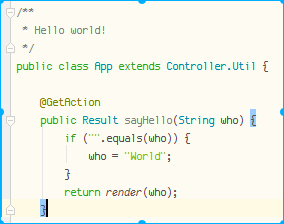

# ActFramework简介

## <a name="prerequisites"></a>准备工作

你需要JDK和Maven来使用ActFramework创建应用程序. 因为需要Maven通过网络从中央库下载依赖包，一个良好的互联网链接也是必须的

1. JDK (Java Development Kit), version 1.7或以上
1. Maven (Project Management Tool), version 3.3或以上

### 安装JDK

从[Java官网](http://www.oracle.com/technetwork/java/javase/downloads/index.html)下载JDK并安装

### 安装Maven

从[Maven官网](http://maven.apache.org/)下载Maven. 参照[教程](http://maven.apache.org/install.html)安装Maven到你的操作系统

## <a name="create_hello_world_app"></a>创建一个"Hello world"应用程序

ActFramework使用maven构建项目. 目前最简单的办法是拷贝[pom实例文件](https://gist.github.com/greenlaw110/5d06ebd848c87c46302d)到你的项目中

### 1. 使用maven生成应用框架:

```
mvn archetype:generate -DgroupId=com.mycom.helloworld -DartifactId=helloworld -DarchetypeArtifactId=maven-archetype-quickstart -DinteractiveMode=false
``` 

运行上述命令之后你的项目目录应该是下面的样子: 

```
.
└── helloworld
    ├── pom.xml
    └── src
        ├── main
        │   └── java
        │       └── com
        │           └── mycom
        │               └── helloworld
        │                   └── App.java
        └── test
            └── java
                └── com
                    └── mycom
                        └── helloworld
                            └── AppTest.java
```

下面拷贝[pom示例文件](https://gist.github.com/greenlaw110/5d06ebd848c87c46302d)并替换自动生成的`pom.xml`文件.

### 2. 导入项目到你的IDE

基本上所有的IDE都支持maven项目. 下面使用IntelliJ IDEA做演示.

选择`File/New/Project from Existing Sources...`启动导入向导:


在文件选择框中选定`pom.xml`文件并点击`OK`按钮, 然后一直按"Next"按钮直到结束.

导入后在Intelli IDEA中打开项目:

 

### 3. 加入请求响应器

更新`App.java`文件 

1. 加入一个返回"Hello World!"的响应器
2. 更新`main`方法让ActFramework运行程序 

```java
package com.mycom.helloworld;

import act.boot.app.RunApp;
import org.osgl.mvc.annotation.GetAction;

/**
 * Hello world!
 */
public class App {

    @GetAction
    public String sayHello() {
        return "Hello World!";
    }

    public static void main(String[] args) throws Exception {
        RunApp.start(App.class);
    }
}
```

### 4. 启动应用

现在按`ctrl-shift-F10`来启动`App`


启动浏览器并打开<a href="http://localhost:5460"><code>http://localhost:5460</code></a>


Duang! 你的第一个Actframework程序启动起来了. 很简单，不是吗？坐稳了，旅程才刚刚开始……

### 5. 加入更多的请求响应器

没有那个Web应用只能响应一个请求. 现在加入另一个响应器到`App.java`文件中，该响应器处理发送到`/bye`的请求.

```java
    @GetAction("/bye")
    public String sayBye() {
        return "Bye!";
    }
``` 

加完方法后, 切换到你的浏览器打开<a href="http://localhost:5460/bye"><code>http://localhost:5460/bye</code></a>, 你应该能看到如下效果:


**小贴士** 使用ActFramework开发不需要重启应用，改完代码后直接刷F5即可看到效果

### 6. 使用模板

真正的项目不会只是返回字串那么简单，通常都需要使用模板来定义返回内容. ActFramework内置了[Rythm](http://rythmengine.org)模板引擎.　现在开始增强应用程序使用模板来定义输出

首先更新`App.java`将`sayHello`方法改变为:

```java
    @GetAction
    public void sayHello() {
    }
```

在`/src/main/resources/rythm/com/mycom/helloworld/App`目录下添加一个`sayHello.html`文件


**小贴士** 模板文件定位规则是:

```
/src/main/resources/rythm/com/mycom/helloworld/App
-------------------
  资源文件根目录
                   rythm
                   ------
                   模板 
                   引擎 
                   id
                         com/mycom/helloworld/App
                         ---------------------------
                         控制器类的全名
                         
```

文件名`sayHello.html`则对应请求响应方法和响应内容格式，在我们的例子中`sayHello`对应了方法名，而后缀`.html`则对应响应内容格式

下面是模板文件内容:

```html
<!DOCTYPE html>
<html>
<head>
<title>Hello World App</title>
</head>
<body>
<h1>Hello World!</h1>
</body>
</html>
``` 

创建好模板文件之后, 切换回浏览器并打开<a href="http://localhost:5460"><code>http://localhost:5460</code></a>你应该看到如下效果:


留一道家庭作业：将`sayBye`方法改造为使用模板返回响应结果

### 7. 处理请求参数

现在让我们给hello world应用增加一些动态特性，让程序能够对任何人说hello。假设请求发送方式允许增加一个参数`who`:　`GET /?who=anyone`

`sayHello`响应方法需要做相应的更改:

```java
    @GetAction
    public Result sayHello(String who) {
        if ("".equals(who)) {
            who = "World";
        }
        return Controller.Util.render(who);
    }
```

**注意** `Result` and `Controller`是两个新的类，需要使用下面的语句导入

```java
import act.controller.Controller;
import org.osgl.mvc.result.Result;
```
 
下面是修改后的`sayHello.html`模板文件:

```html
<!DOCTYPE html>
@args String who
<html>
<head>
<title>Hello World App</title>
</head>
<body>
<h1>Hello @who!</h1>
</body>
</html>
``` 

完成修改后，切换到浏览器并打开<a href="http://localhost:5460?who=Act"><code>http://localhost:5460?who=Act</code></a>, 你应该能看到如下结果：


上面的代码有用到`Controller.Util.render`方法，写起来比较冗长，简化这种写法有两种途径:

1. 让控制器继承`act.controller.Controller.Util`类, 这也是我比较喜欢的一种方式:

    
    
2. 如果你的控制器已经继承了其他类，这时候你可以使用[静态引用](https://docs.oracle.com/javase/1.5.0/docs/guide/language/static-import.html):

    

不管那种方式你都可以用一种更简洁的方式来调用｀Controller.Util｀类`render`方法：

```java
    render(who);
```

## <a name="anatomy"></a>ActFramework应用项目剖析

ActFramework使用标准的maven项目布局来组织文件. 第一次编译后的项目看起来是这样的:

```
.
├── pom.xml
├── src
│   ├── main
│   │   ├── asset                               -> 静态资源, 可以直接通过"/asset"访问
│   │   │   ├── css                             -> CSS 文件
│   │   │   ├── img                             -> 图片文件
│   │   │   └── js                              -> Javascript 文件
│   │   ├── java                                -> Java 源码
│   │   │   └── com
│   │   │       └── mycom
│   │   │           └── myprj
│   │   │               ├── Application.java    -> 应用程序入口(提供main()方法)
│   │   │               ├── controller          -> 控制器目录
│   │   │               ├── event               -> 事件和事件响应器目录
│   │   │               ├── mail                -> 邮件发送器目录
│   │   │               ├── model               -> 域模型以及数据访问对象目录
│   │   │               └── util                -> 工具类目录
│   │   └── resources                           -> 资源文件
│   │       ├── conf                            -> 配置根目录
│   │       │   ├── common                      -> 存放缺省配置
│   │       │   ├── sit                         -> "sit" 配置
│   │       │   └── dev                         -> "dev" 配置
│   │       ├── messages.properties             -> 国际化资源文件
│   │       ├── routes                          -> 路由表
│   │       └── rythm                           -> Rythm模板根目录
│   │           ├── com
│   │           │   └── mycomp
│   │           │       └── myprj
│   │           │           ├── controller      -> 控制器模板目录
│   │           │           └── mail            -> 邮件发送器模板目录
│   │           └── __global.rythm              -> 全局模板工具
│   └── test
│       ├── java                                -> 单元测试源文件
│       │   └── com
│       │       └── mycom
│       │           └── myprj
│       └── resources                           -> 单元测试资源
└── target                                      -> maven项目构建目录
    ├── dist                                    -> 发布包目录
    └── tmp
        └── uploads                             -> 存放上传文件的临时目录
```

**注意** 根据你的应用程序的包组织方式，你看到的有可能和以上结构有不一样的地方

1. 包组织方式完全由项目决定。你的项目中可能使用了`service`包而不是`controller`来存放所有的RESTful控制器类。 而你的业务层也许不是一个`model`包, 而是分布在多个不同的包里. ActFramework在项目文件组织上没有任何限制
1. ActFramework使用`common`配置目录来获取缺省的配置信息。而上例所示的`sit`和`dev`目录则完全由项目决定，你可以使用其他任何名字，你也可以增加另一种配置组，比如`uat`。如果项目不需要多个配置组，使用`common`即可。
1. 如果路由都通过注解方式指定，`routes`文件可以不用提供. 一旦`routes`文件被检测到，其中的条目可以覆盖注解指定路由


## 总结

本单元说明了以下内容

1. 准备工作
1. 通过maven生成项目文件，如何拷贝示例`pom.xml`文件覆盖生成的`pom.xml`文件
1. 在`main`方法调用`RunApp.start`方法来启动ActFramework应用程序
1. 添加请求响应方法
1. 使用模板来生成复杂响应
1. 处理请求参数
1. ActFramework程序结构解析

[返回目录](index.md)
